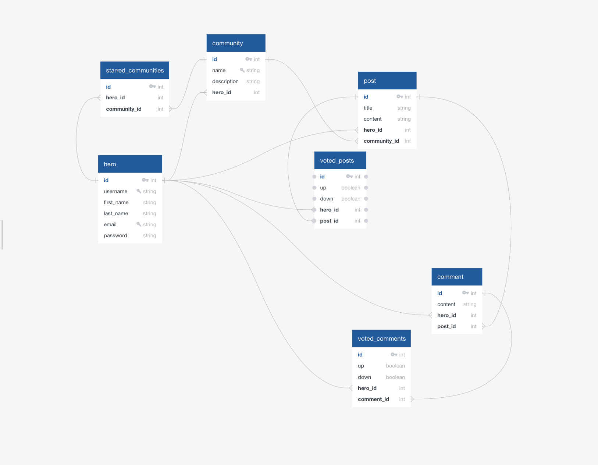

# Eco-mmunity Backend

__Take a look at the [front-end](https://github.com/Lexscher/eco-mmunity)__

Backend Technologies:

- [Ruby on Rails](https://rubyonrails.org/)
- [bCrypt](https://rubygems.org/gems/bcrypt/versions/3.1.12)
- [JSON Wrb Token](https://rubygems.org/gems/jwt)
- [Fast JSON API](https://github.com/Netflix/fast_jsonapi)

## ERD



### Closer breakdown of the models:

```
hero
-
id PK int
username UNIQUE string
first_name string
last_name string
email UNIQUE string
password string

community
-
id PK int
name UNIQUE string
description string
hero_id int FK >- hero.id

post
-
id PK int
title string
content string
hero_id int FK >- hero.id
community_id int FK >- community.id

comment
-
id PK int
content string
hero_id FK >- hero.id
post_id FK >- post.id

starred_communities
-
id PK int
hero_id FK >- hero.id
community_id FK >- community.id

voted_posts
-
id PK
up boolean
down boolean
hero_id FK >- hero.id
post_id FK >- post.id

voted_comments
-
id PK
up boolean
down boolean
hero_id FK >- hero.id
comment_id FK >- comment.id
```

Created by [Alexander Schelchere](https://www.alexanderschelchere.com)
